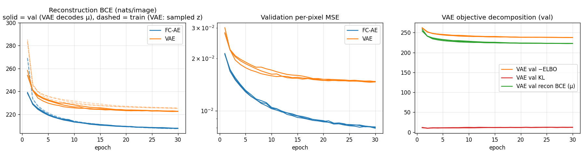
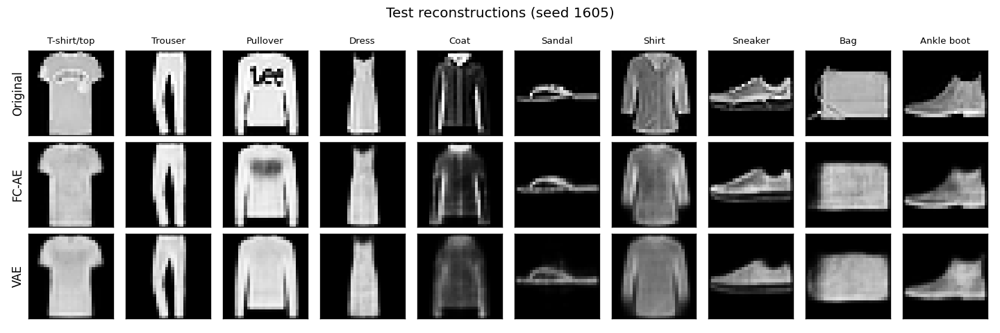
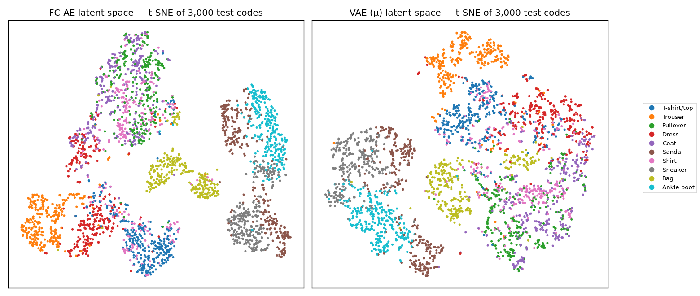
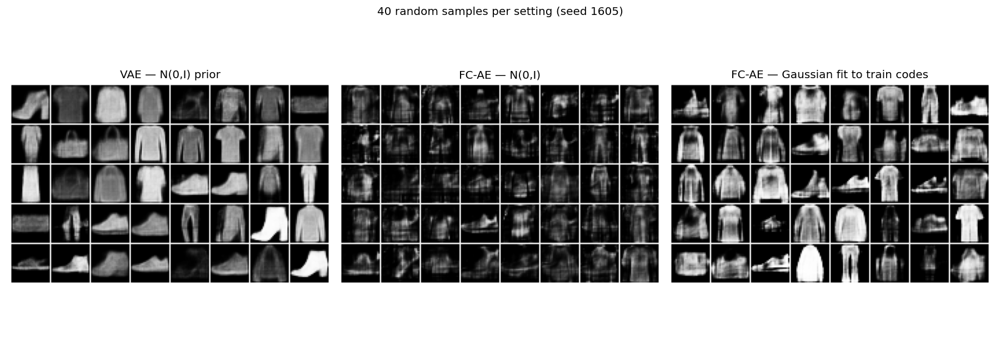
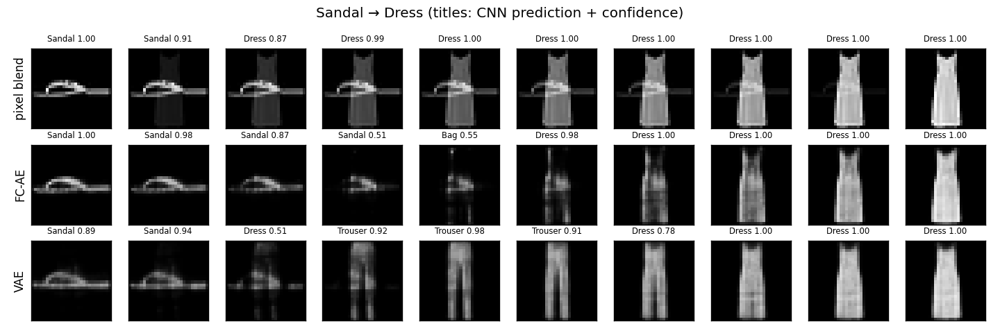

**Personal Parameters (Section 0.1)**

| Parameter | Value | Use in HW7 |
|---|---|---|
| SID4 | 1605 | — |
| SEED | 1605 | train/val split, weight init, data order; repeats with seeds 1605, 1606, 1607 |
| SLICE | 605 | not used by HW7 |
| HP_ID | 3 | not used: the assignment waives the second hyper-parameter model for HW7 |
| CLS_A | 5 (*Sandal*) | start point of the latent interpolation (Part 4) |
| CLS_B | 3 (*Dress*) | end point of the latent interpolation (Part 4) |

---

## Part 1 — GAN architecture and the adversarial game

A **Generative Adversarial Network** (Goodfellow et al., 2014) learns to generate data by setting
two neural networks against each other:

- **Generator $G_\theta$.** It maps a random noise vector $z \sim p_z$ (e.g. $\mathcal N(0, I)$,
  100-d) to a sample $G(z)$ in data space (e.g. a 28×28 image). It never sees real data
  directly; its only learning signal is the gradient that flows back through the discriminator.
  Its job is to make $p_g$, the distribution of $G(z)$, match the data distribution $p_{data}$.
- **Discriminator $D_\phi$.** It is a binary classifier that takes a sample $x$ and outputs
  $D(x)\in[0,1]$, the probability that $x$ came from the real data rather than from $G$. It acts
  as a *learned, adaptive loss function* for the generator.

**How they interact during training.** The two networks play a two-player minimax game over the
value function

$$\min_G \max_D \; V(D,G) = \mathbb E_{x\sim p_{data}}[\log D(x)] + \mathbb E_{z\sim p_z}[\log(1-D(G(z)))].$$

Training alternates gradient steps on the two networks:

1. **Discriminator step.** Take a minibatch of real images (label 1) and a minibatch of generated
   images $G(z)$ (label 0), with $G$ frozen. Update $D$ by gradient *ascent* on $V$, which is the
   same as minimizing binary cross-entropy. $D$ gets better at telling real from fake.
2. **Generator step.** Take a fresh $z$ and freeze $D$. Update $G$ so that $D$ assigns its samples
   a high "real" probability. Gradients pass *through* $D$ into $G$, so they tell $G$ which
   direction in pixel space makes an image look more real. In practice $G$ maximizes
   $\log D(G(z))$, the **non-saturating** loss, rather than minimizing $\log(1-D(G(z)))$. The
   original form gives vanishing gradients early in training, when $D$ easily rejects every fake.

Each network's improvement makes the other's task harder. A better $D$ gives $G$ a sharper
signal, and a better $G$ forces $D$ to find subtler differences.

**Theoretical goal.** For a fixed $G$ the optimal discriminator is
$D^*(x) = \frac{p_{data}(x)}{p_{data}(x)+p_g(x)}$. Substituting it back in gives

$$V(D^*, G) = -\log 4 + 2\,\mathrm{JSD}(p_{data}\,\|\,p_g),$$

so training $G$ against an optimal $D$ minimizes the **Jensen–Shannon divergence** between the
model and data distributions. The global optimum is a **Nash equilibrium** with $p_g = p_{data}$.
There, $D(x)=\tfrac12$ everywhere: the discriminator can do no better than a coin flip, and the
generator has learned the data distribution *implicitly*. It can sample from it, but it never
writes down an explicit likelihood. In practice, the networks have finite capacity and are
trained by alternating SGD rather than to optimality at each step. So this equilibrium is an
idealization, and the gap between theory and practice causes the instabilities described in
Part 2.

---

## Part 2 — Mode collapse

**Definition.** Mode collapse (the "Helvetica scenario") happens when the generator produces only
a small subset of the data distribution's modes. Many different noise vectors $z$ map to the same
or nearly the same output, so samples lack diversity. Examples: a FashionMNIST GAN that produces
only sneakers and trousers, or a face GAN that produces the same few faces. *Partial* collapse
covers a few modes; *complete* collapse maps every $z$ to one output. Each sample can still look
realistic, which is why the problem is easy to miss if you only check per-sample quality.

**Why it occurs.**

1. **The generator optimizes against the current discriminator, not the true objective.** In the
   alternating game, the best response for $G$ to a fixed $D$ is to put all its mass on whichever
   single point $D$ currently rates as most real. Nothing in a single generator update rewards
   *coverage*. $D$ then learns to reject that point, and $G$ jumps to another one. The result is
   cycling between modes instead of convergence to an equilibrium that covers all of them.
   Simultaneous gradient descent does not solve the max-min problem; it approximates a min-max
   problem, and the min-max solution for $G$ is a single point.
2. **Mode-dropping is cheap under the divergence being minimized.** The non-saturating generator
   loss behaves like $\mathrm{KL}(p_g\|p_{data}) - 2\,\mathrm{JSD}$. Reverse KL heavily penalizes
   generating *unrealistic* samples, where $p_g>0$ but $p_{data}\approx 0$. It barely penalizes
   *missing* real modes, where $p_{data}>0$ but $p_g\approx 0$. So dropping modes costs little.
3. **Vanishing or uninformative gradients.** When real and fake distributions sit on
   low-dimensional manifolds that barely overlap, a near-perfect discriminator saturates.
   JSD is then constant ($\log 2$), so the gradient tells $G$ nothing about how to move toward
   uncovered modes.

**Mitigation techniques.**

- **Wasserstein GAN / WGAN-GP (Arjovsky et al., 2017; Gulrajani et al., 2017).** WGAN replaces
  JSD with the Earth-Mover (Wasserstein-1) distance,
  $W(p_{data},p_g)=\sup_{\|f\|_L\le 1}\mathbb E_{p_{data}}[f(x)]-\mathbb E_{p_g}[f(x)]$.
  The discriminator becomes a *critic* $f$ with unbounded real-valued outputs, constrained to be
  1-Lipschitz. WGAN-GP enforces this with a gradient penalty
  $\lambda\,\mathbb E_{\hat x}[(\|\nabla_{\hat x} f(\hat x)\|_2-1)^2]$ on interpolates between real
  and fake samples. *Mechanism:* the Wasserstein distance stays continuous and gives useful
  gradients even when the distributions don't overlap. It measures *how far* mass must move, not
  just *whether* the supports overlap. The critic's gradient therefore points $G$ toward the
  regions of real data it isn't covering, rather than toward the critic's single favourite
  point. The critic can be trained close to optimality (e.g. 5 critic steps per $G$ step) without
  its gradients vanishing, which removes the cycling dynamic. The critic loss also tracks sample
  quality, which makes training easier to monitor.

- **Minibatch discrimination / minibatch standard deviation (Salimans et al., 2016; Karras et
  al., 2018).** A standard discriminator judges each sample independently, so it cannot see that
  a whole batch is identical. Minibatch discrimination gives $D$ features that compare each
  sample with the others in its batch: a learned tensor projects features, and L1 distances to
  the other samples are summed into a "closeness" statistic. ProGAN and StyleGAN use a simpler
  version: the standard deviation of each feature across the batch, averaged and appended as an
  extra feature map. *Mechanism:* a collapsed generator yields batches with abnormally low
  diversity. $D$ can now detect that directly and reject the whole batch, so $G$ is penalized for
  low diversity and pushed to spread its outputs.

- **Unrolled GANs (Metz et al., 2017)** *(a third technique).* The generator's loss is computed
  against a copy of $D$ that has been updated $k$ steps ahead, and gradients are back-propagated
  through those $k$ updates. *Mechanism:* $G$ can "see" how $D$ will react. Collapsing onto one
  mode is no longer a good move, because $G$ anticipates that $D$ will reject that mode in the
  next steps. This approximates the true max-min objective instead of the myopic best response.

Other measures that help: spectral normalization of $D$ (a cheap Lipschitz constraint),
two-time-scale learning rates (TTUR), experience replay of old fakes, and PacGAN (giving $D$
several samples packed together).

---

## Part 3 — Three significant GAN variants

### 3.1 DCGAN — Deep Convolutional GAN (Radford, Metz & Chintala, 2016)

**Problem addressed.** The original GANs used fully connected networks. They were notoriously
unstable once scaled to convolutional architectures and realistic image sizes. Training often
diverged or collapsed, and there was no reliable recipe for building a working image GAN.

**Innovations.** DCGAN is a set of architectural guidelines, found empirically, that made
convolutional GANs train stably:

- *No pooling layers.* Strided convolutions in $D$ and fractionally strided (transposed)
  convolutions in $G$, so each network learns its own down- and up-sampling.
- *Batch normalization* in both networks (except the $G$ output and the $D$ input layers). This
  stabilizes gradient flow and helps prevent $G$ from collapsing all samples to one point.
- *No fully connected hidden layers.* $z$ is projected and reshaped into a small spatial tensor,
  and $D$'s last conv features feed a single sigmoid output.
- *Activations:* ReLU in $G$ with a **tanh** output; **LeakyReLU** (slope 0.2) throughout $D$, so
  that gradients reach $G$ even for confidently rejected samples.
- *Optimizer:* Adam with lr 2e-4 and $\beta_1 = 0.5$ (instead of 0.9) to reduce oscillation.

It also showed that the learned latent space has structure, including vector arithmetic such as
*smiling woman − neutral woman + neutral man ≈ smiling man*. And $D$'s features are useful for
downstream classification. DCGAN became the standard baseline that most later image GANs build on.

### 3.2 Conditional GAN — cGAN (Mirza & Osindero, 2014; extended by pix2pix, Isola et al., 2017)

**Problem addressed.** An unconditional GAN gives no control over *what* it generates. You cannot
ask for a "7" or a "sandal". Many applications need generation conditioned on side information:
class-specific synthesis, text-to-image, and image-to-image translation.

**Innovations.** Both networks receive the condition $y$ (a class label, text embedding, or
image):

$$\min_G\max_D\;\mathbb E_{x,y}[\log D(x\mid y)] + \mathbb E_{z,y}[\log(1-D(G(z\mid y)\mid y))].$$

- $G(z, y)$ concatenates (or otherwise injects) $y$ with the noise.
- $D(x, y)$ judges whether $x$ is real **and** matches $y$. A realistic sneaker labelled "dress"
  is rejected, so $G$ must respect the condition.
- Later work improved how the condition is injected: **projection discriminators**
  (inner product of the class embedding with $D$'s features), **conditional batch norm**
  (class-dependent BN scale and shift, used in BigGAN), and **AC-GAN** (an auxiliary classifier
  head on $D$).
- **pix2pix** treats an input image as the condition. It uses a U-Net generator (skip
  connections keep low-level structure), an extra L1 reconstruction loss, and a **PatchGAN**
  discriminator that classifies local $N\times N$ patches. This made paired image-to-image
  translation (maps↔aerial photos, edges→photos, labels→street scenes) possible.

Conditioning also tends to reduce mode collapse in practice, because the label forces $G$ to
cover every class.

### 3.3 CycleGAN (Zhu, Park, Isola & Efros, 2017)

**Problem addressed.** pix2pix needs **paired** training data (the same scene in both domains).
Such pairs are expensive or impossible to collect, e.g. horses↔zebras, photos↔Monet paintings,
or summer↔winter scenes. CycleGAN does image-to-image translation from **unpaired** collections of
the two domains.

**Innovations.**

- *Two generators and two discriminators.* $G: X\to Y$ and $F: Y\to X$, with $D_Y$ judging
  whether $G(x)$ looks like domain $Y$ and $D_X$ judging $F(y)$.
- *Cycle-consistency loss.* Adversarial losses alone are under-constrained: $G$ could map every
  horse to the *same* realistic zebra, a form of mode collapse, or ignore the input's content.
  CycleGAN requires translating there and back to recover the input:
  $\mathcal L_{cyc}=\mathbb E_x\|F(G(x))-x\|_1+\mathbb E_y\|G(F(y))-y\|_1$.
  This forces the mapping to preserve content (pose, layout), with only style changing.
  The full loss is $\mathcal L_{GAN}(G,D_Y)+\mathcal L_{GAN}(F,D_X)+\lambda\mathcal L_{cyc}$, with
  $\lambda=10$.
- *Optional identity loss* $\|G(y)-y\|_1$, which preserves colour composition (e.g. for
  painting→photo).
- *Stabilization:* a least-squares GAN loss instead of the log loss, a PatchGAN discriminator,
  and a history buffer of 50 previously generated images used to update $D$. The buffer reduces
  oscillation.

Limitation: CycleGAN handles appearance and texture changes well but struggles with large
geometric changes (e.g. dog→cat shape).

*(StyleGAN, Karras et al., 2019, is another major variant. It addresses poor control over and
entanglement of the latent space. A mapping network turns $z$ into an intermediate latent $w$,
which modulates each generator layer through AdaIN, and per-layer noise inputs plus style
mixing separate coarse attributes from fine ones.)*

---

## Part 4 — FC-AE vs. VAE on FashionMNIST (PyTorch)

The full implementation, executed outputs and figures are in `autoencoders_fashionmnist.ipynb`.

**Data.** FashionMNIST: 60,000 train and 10,000 test images (28×28, 10 classes, pixels scaled to
[0, 1]). A seeded split (SEED = 1605) holds out 6,000 training images for validation curves,
leaving 54,000 for training. The test set is used only for final evaluation. Dataset MD5s match
torchvision's published checksums.

**Models (same capacity; the only difference is the variational objective).**

| | FC-AE | VAE |
|---|---|---|
| Encoder | 784→512→256→32 (ReLU) | 784→512→256 → $\mu,\log\sigma^2\in\mathbb R^{32}$ |
| Latent | $z=f(x)$ | $z=\mu+\sigma\odot\varepsilon$ (reparameterization) |
| Decoder | 32→256→512→784 logits | same |
| Loss / image | BCE summed over pixels | BCE + KL$(q(z\mid x)\,\|\,\mathcal N(0,I))$ = −ELBO |
| Parameters | 1,083,696 | 1,091,920 |

**Training.** Adam, lr 1e-3, batch 128, 30 epochs, on an Apple M4 GPU (MPS). Each model was
trained with 3 seeds (1605, 1606, 1607): ~1.1 min per FC-AE run and ~1.4 min per VAE run.

**Evaluation.** (1) Test reconstruction MSE, PSNR, SSIM and BCE; VAE reconstructions decode $\mu$.
(2) Linear-probe accuracy on the 32-d codes, plus t-SNE. (3) Generation: 10,000 decoded random
codes, scored with a separately trained CNN (90.9% test accuracy). The scores are a
classifier-feature Fréchet distance (C-FID), an Inception-style score, and the predicted-class
distribution. (4) Latent interpolation between a Sandal (CLS_A) and a Dress (CLS_B).

{width=100%}

{width=100%}

{width=95%}

{width=100%}

{width=100%}

All numbers below come from the executed notebook's outputs (also in `outputs/all_outputs.json`). They are means ± std over training seeds 1605/1606/1607 unless a seed is named.

### 4.1 Reconstruction: FC-AE wins clearly

| Test set (10,000 images) | FC-AE | VAE |
|---|---|---|
| MSE / pixel | **0.00807 ± 0.00007** | 0.01484 ± 0.00006 |
| PSNR (dB) | **22.12 ± 0.03** | 19.17 ± 0.02 |
| SSIM | **0.748 ± 0.001** | 0.642 ± 0.002 |
| BCE (nats/image) | **209.78 ± 0.15** | 224.71 ± 0.10 |
| KL (nats/image) | — | 12.19 ± 0.32 |
| −ELBO (nats/image) | — | 239.84 ± 0.10 |

* The two models have the same architecture and the same reconstruction loss. Even so, the VAE's MSE is **1.84× higher**, and 1.6–2.1× higher in every class (per-class table in the notebook / `METRICS.md`). Both models find **Bag** and **Sandal** hardest: thin straps, prints and handle shapes vary a lot between items. **Trouser** is easiest.
* The reconstruction grid shows *how* they differ. FC-AE reconstructions keep stripes, the pullover logo region and the sandal straps. VAE reconstructions are smoother "prototype" garments, with the coat's texture and the shirt's buttons averaged away.
* **Why.** The KL term charges ~12 nats for every bit of information the code carries. The model responds by switching most latent dimensions off: only **6 of 32** dims have KL > 0.01 nats (seed 1605); the other 26 output $\mu\approx0$, $\sigma\approx1$ and carry no information. So the VAE effectively compresses through a **6-d** bottleneck, against 32 for the FC-AE. That is the classic rate–distortion trade-off of the ELBO, sometimes called partial posterior collapse. It was *not* visible after one epoch: the smoke test showed 31/32 dims active, so the pruning happens during training.
* Neither model overfits: train and validation BCE track each other for 30 epochs. The VAE's dashed "train" curve sits above its validation curve because training decodes a *sampled* z while validation decodes μ.

### 4.2 Latent space: FC-AE codes are more linearly separable; VAE codes are smoother

* Linear-probe test accuracy: **FC-AE 83.0 ± 0.1%**, VAE 80.9 ± 0.6%, raw 784-d pixels 83.3%. The FC-AE's 32-d code keeps almost all of the linearly available class information in the pixels. The VAE loses ~2 points, consistent with its 6 active dims.
* In the t-SNE map, the FC-AE forms tighter, more separated islands, e.g. Bag and the footwear group. The VAE map is one more continuous sheet. Tops (T-shirt/Pullover/Coat/Shirt) blend into each other, and footwear forms a connected Sneaker–Sandal–Ankle-boot region.

### 4.3 Generation: the VAE is a generative model; the plain FC-AE is not, unless you add a density model

| 10,000 samples, scored by a 90.9%-accurate FashionMNIST CNN | C-FID ↓ | IS-style ↑ | mean max-conf ↑ | class entropy ↑ |
|---|---|---|---|---|
| Real train images (reference) | 0.5 | 8.38 | 0.935 | 0.999 |
| **VAE, z ~ N(0, I)** | 111.6 ± 2.5 | **5.54 ± 0.04** | **0.804** | 0.965 |
| FC-AE, z ~ N(0, I) | 223.4 ± 9.2 | 3.01 ± 0.12 | 0.636 | 0.883 |
| FC-AE, z ~ Gaussian fitted to train codes | **92.8 ± 5.1** | 4.81 ± 0.07 | 0.752 | 0.967 |

* **Naive sampling separates the two models cleanly.** Decoding N(0, I) noise through the FC-AE gives textured, half-formed garments: C-FID 2× worse and IS-style 3.0 vs 5.5. The FC-AE's latent space was never shaped to match any prior; its per-dim std ranges from 0.97 to 2.65, with offset means. The VAE's KL term makes N(0, I) a valid sampling distribution by construction, and its samples are clean, recognisable garments.
* **The FC-AE gap is mostly about *where* to sample, not about the decoder.** If a full-covariance Gaussian is fitted to the FC-AE's training codes, its samples get the **best C-FID (92.8)**: their feature statistics, including texture detail, are closer to real data. But they are less often confidently one class (0.75 vs 0.80 confidence, IS 4.8 vs 5.5), and the grid shows more broken shapes. The VAE trades sharpness for samples that are reliably "on-manifold". This is why VAE samples look blurry yet clean.
* **No mode collapse in either model**, but neither covers the classes evenly. Normalised predicted-class entropy is 0.965 (VAE) and 0.967 (FC-AE fit), against 0.999 for real data. The VAE under-produces **Coat (4.0%)** and **Sandal (4.2%)**, against ~9–10% for real data, and over-produces Pullover/Dress/Bag/Ankle boot. Sandals are thin and high-frequency, so a blurry decoder rarely produces one that the CNN accepts. This is the VAE's *mode-averaging* behaviour, the mirror image of a GAN's mode dropping (Part 2).

### 4.4 Interpolation Sandal (CLS_A = 5) → Dress (CLS_B = 3)

* **Pixel blend:** a cross-fade where a dress and a sandal are overlaid. The CNN is still very confident (0.977), which shows that classifier confidence is not a realism metric on its own.
* **FC-AE:** keeps the sandal for 4 frames, then passes through faint, nearly empty frames (CNN: *Sandal 0.51*, *Bag 0.55*) before a dress appears. Straight lines between FC-AE codes cross low-density "holes" that the decoder never learned to fill.
* **VAE:** every frame is a plausible garment. The path runs Sandal → (Dress 0.51) → **Trouser ×3** → Dress, i.e. it walks *through* another class region instead of fading. This is what the KL prior buys: the space between codes is filled with decodable points, so the latent space is continuous.

### 4.5 Bottom line
For **compression and reconstruction**, the FC-AE is better on every metric (1.8× lower MSE, +2.9 dB PSNR, +0.11 SSIM) and gives more linearly separable features. For **generation and smooth latent traversal**, the VAE is the right model: sampling from its prior works by construction, and its interpolations stay on the data manifold. Its price is blurrier reconstructions and a latent space where 26 of 32 dims go unused. An FC-AE can be made competitive at sampling with a post-hoc density on its codes, but then the sampling distribution is fitted after training rather than built into the objective.

---

Standing-requirement artifacts (`RUN_LOG.txt`, `METRICS.md`, `AI_USE.md`, `checkpoints/`,
`figures/`, `outputs/`) accompany this report, per Section 0.3.

